# C4 — Container (Release 0.8)

Часть [SF-DOC-04](../ROADMAP.md). Контекстный уровень (SixFeat platform как
единая System среди GAME/Genius/Яндекс) — в [c4-context.md](./c4-context.md).
Порты, ответственность и Postgres-зависимость каждого сервиса подробнее — в
разделе «Сервисы» [docs/DEVELOPMENT.md](../DEVELOPMENT.md).
Обоснование самого разбиения на сервисы — [ADR-0001](../adr/0001-split-into-four-services.md)
и последующие ADR по каждому сервису; почему нет отдельного
BFF-сервиса поверх этого — [ADR-0012](../adr/0012-six-feat-as-sole-public-entry.md).

## Диаграмма

Та же палитра, что и в [c4-context.md](./c4-context.md) (токены
`front/src/styles/tokens.css`, тёмная тема), с ролью, закодированной
цветом акцента карточки: `--signal` (тил) — сервисы домена (six-feat,
auth, enrichment, game); `--pulse` (фиолетовый) — исходящие gateway'и
(genius-gw, yandex-gw); `--amber` — nginx (единственная публичная точка
входа); `--primary2` — Postgres; `--mist` — внешние системы.

```mermaid
%%{init: {
  "theme": "base",
  "themeVariables": {
    "background": "#0B0E14",
    "primaryColor": "#1B2236",
    "primaryTextColor": "#EDEFF4",
    "primaryBorderColor": "#283044",
    "lineColor": "#8A94A6",
    "secondaryColor": "#1B2236",
    "tertiaryColor": "#141A28",
    "edgeLabelBackground": "#141A28",
    "clusterBkg": "#0E1320",
    "clusterBorder": "#5EE6C5",
    "fontFamily": "Inter, system-ui, sans-serif"
  }
}}%%
flowchart TB
    user(["`👤 **Пользователь**
Браузер`"])

    subgraph SF["SixFeat platform"]
        direction TB
        nginx["`**nginx**
*«nginx:1.27-alpine»*
Единственная публичная точка входа (ADR-0012). Роутинг по префиксу пути, gzip, без бизнес-логики — не BFF.`"]

        sixfeat["`**six-feat**
*«C++ / userver»*
Порт 8080. /api/v1/graph, /path, /search, /status(/stream), /, /healthz, /readyz. Локально проверяет сессионную cookie (ADR-0004). Оркестрирует ArtistRepository + MusicSourceProviderChain.`"]

        auth["`**six-feat-auth**
*«C++ / userver»*
Порт 8083. Весь OAuth 2.0 Authorization Code Flow: /auth/login, /auth/callback, /auth/logout, /auth/me (ADR-0004).`"]

        game["`**six-feat-game**
*«C++ / userver»*
Порт 8084. /api/v1/game/*. Своя сессия (локально, как six-feat), анти-чит — internal-mesh вызов в six-feat (ADR-0007).`"]

        enrichment["`**six-feat-enrichment**
*«C++ / userver»*
Порт 8081. Фоновый глубокий скан коллабораций через six-feat-genius-gateway, заполняет L1/L2-кэш заранее (ADR-0002).`"]

        genius_gw["`**six-feat-genius-gateway**
*«C++ / userver»*
Порт 8082. Весь исходящий трафик к Genius API: CircuitBreaker + FG/BG rate-limiting централизованы здесь (ADR-0003).`"]

        yandex_gw["`**six-feat-yandex-gateway**
*«C++ / userver»*
Порт 8090. Весь исходящий трафик к Яндекс.Музыке — сервисный токен (обязательный дефолт) + device-flow OAuth (задел, SF-YM-01). Тот же CircuitBreaker/rate-limiting паттерн, что у genius-gateway.`"]

        postgres[("`**Postgres**
*«postgres:16-alpine»*
Общий кластер: L1-кэш артистов/треков/коллабораций (six-feat/enrichment), свой реестр миграций для game.`")]
    end

    genius_ext["`**Genius API**
*«external system»*
api.genius.com`"]

    yandex_ext["`**Яндекс.Музыка**
*«external system»*
Неофициальный API`"]

    user -->|"HTTPS<br/>порт NGINX_PUBLIC_PORT (дефолт 8080)"| nginx
    nginx -->|"/, /api/v1/graph,/path,/search,/status*, /healthz, /readyz"| sixfeat
    nginx -->|"/auth/*"| auth
    nginx -->|"/api/v1/game/*"| game

    sixfeat -->|"ArtistRepository: L1 read/write-through<br/>SQL"| postgres
    game -->|"Свой реестр миграций postgresql/migrations/game/<br/>SQL"| postgres
    enrichment -->|"ArtistRepository (тот же кластер)<br/>SQL"| postgres

    sixfeat -->|"GeniusGatewayClient: артисты/треки/сиды/резолв<br/>internal-mesh HTTP"| genius_gw
    sixfeat -->|"YandexMusicSourceProvider: co-appearance рёбра<br/>internal-mesh HTTP"| yandex_gw
    enrichment -->|"Фоновый глубокий скан<br/>internal-mesh HTTP"| genius_gw
    game -->|"/internal/neighbours — анти-чит<br/>internal-mesh HTTP"| sixfeat
    sixfeat -->|"/internal/enqueue, /internal/status<br/>internal-mesh HTTP"| enrichment

    auth -->|"Обмен code→access_token напрямую<br/>HTTPS"| genius_ext
    genius_gw -->|"FG/BG-трафик, CircuitBreaker<br/>HTTPS"| genius_ext
    yandex_gw -->|"FG/BG-трафик, CircuitBreaker<br/>HTTPS (реверс-инж.)"| yandex_ext

    classDef person fill:#B98AFF,stroke:#8a5ee0,color:#07120F,stroke-width:2px
    classDef domain fill:#1B2236,stroke:#5EE6C5,color:#EDEFF4,stroke-width:2px
    classDef gateway fill:#1B2236,stroke:#B98AFF,color:#EDEFF4,stroke-width:2px
    classDef nginxStyle fill:#1B2236,stroke:#FFD27A,color:#EDEFF4,stroke-width:2px
    classDef db fill:#1B2236,stroke:#8FA6C9,color:#EDEFF4,stroke-width:2px
    classDef ext fill:#141A28,stroke:#8A94A6,color:#8A94A6,stroke-width:1px

    class user person
    class sixfeat,auth,game,enrichment domain
    class genius_gw,yandex_gw gateway
    class nginx nginxStyle
    class postgres db
    class genius_ext,yandex_ext ext

    style SF fill:#0E1320,stroke:#5EE6C5,stroke-width:1.5px,stroke-dasharray: 4 3
```

## Примечания к диаграмме

- **nginx — не BFF.** Только path-based роутинг + gzip + унификация origin для
  фронтенда (относительные `fetch("/auth/me")` и т.п. попадают в правильный
  контейнер вне зависимости от того, какой из трёх слушает запрос) — никакой
  агрегации/бизнес-логики. См. [ADR-0012](../adr/0012-six-feat-as-sole-public-entry.md)
  почему это не отдельный полноценный API-шлюз.
- **Группы цветов**: синие (six-feat, auth, enrichment, game) — доменные
  сервисы с публичными эндпоинтами или фоновой логикой; фиолетовые
  (genius-gateway, yandex-gateway) — инфраструктурные прокси с
  CircuitBreaker/rate-limiting к внешним API; зелёный (Postgres) — единое
  хранилище; тёмно-серый (nginx) — entry point без бизнес-логики.
- **six-feat-genius-gateway и six-feat-yandex-gateway не проксируются через
  nginx** — они внутренние (compose-сеть), публичного трафика не принимают;
  единственный входящий трафик к ним — от других контейнеров того же контура
  SixFeat platform (пунктирная граница на диаграмме).
- **`GENIUS_REDIRECT_URI`/OAuth-обмен** — `six-feat-auth` ходит в Genius API
  напрямую, в обход `six-feat-genius-gateway` (см. sequence
  [oauth-login.md](./sequences/oauth-login.md) и
  `docs/DEVELOPMENT.md` «OAuth: выдача сессии... vs проверка сессии...»).
- **Постгрес один кластер, не три базы**: `six-feat`/`six-feat-enrichment`
  используют общую схему артистов/треков/коллабораций; `six-feat-game`
  использует тот же физический Postgres-инстанс, но собственный реестр
  миграций (`postgresql/migrations/game/`) — раздельные схемы, не
  раздельные БД. Подробнее топология (реплика, `prod-like`) —
  `docs/DEVELOPMENT.md` «Postgres cluster topology».
