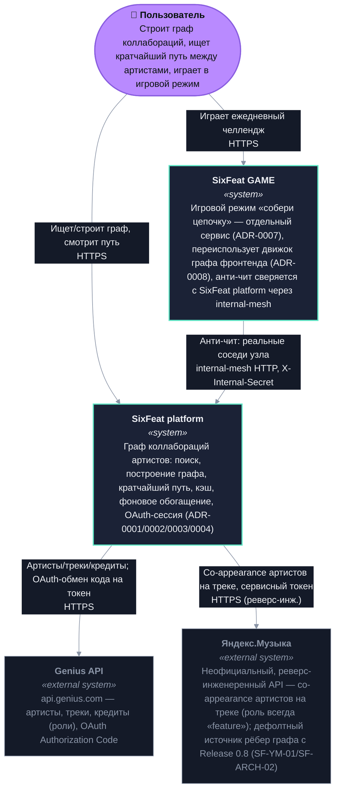

# C4 — Context (Release 0.8)

Часть [SF-DOC-04](../ROADMAP.md). Обоснование архитектурных решений — в
[docs/adr/](../adr/README.md), не здесь; это только карта "кто с кем
разговаривает". Контейнерный уровень (что внутри SixFeat platform) — в
[c4-container.md](./c4-container.md). Конкретные протоколы отдельных
операций — в [sequences/](./sequences/).

## Диаграмма

Палитра — токены `front/src/styles/tokens.css` (тёмная тема): `--ink`
(фон), `--panel-2`/`--line` (карточки/границы), `--signal` (SixFeat
platform/GAME — тот же цвет, что и основной акцент фронтенда), `--pulse`
(пользователь), `--mist` (внешние системы) — не дефолтная C4-палитра.

## Ключевые решения, отражённые здесь

- **Единственный канонический ключ артиста — реальный Genius id**, у обеих
  систем (SixFeat platform и GAME) и у обоих внешних источников рёбер
  (Genius, Яндекс.Музыка) — ни у кого нет своего второго id-пространства.
  См. [ADR-0009](../adr/0009-canonical-artist-identity-in-game.md) и
  [ADR-0011](../adr/0011-music-source-provider-abstraction.md).
- **GAME — отдельная System**, а не контейнер внутри SixFeat platform: у
  неё свой собственный публичный HTTP-контракт
  (`/api/v1/game/*`, через nginx — см. [c4-container.md](./c4-container.md))
  и своя причина существования (ADR-0007), но она структурно зависит от
  SixFeat platform для анти-чита — тот же паттерн, что "другая система в
  ландшафте", а не подсистема.
- **Яндекс.Музыка теперь foundational, а не "когда-нибудь"**: с Release 0.8
  (SF-YM-01, SF-ARCH-02) это дефолтный, обязательный источник рёбер
  дефолтного графа — не опциональное дополнение. Genius остаётся
  источником сидов/резолва артистов, углубления по ролям (producer/writer/
  featured) и fallback при недоступности Яндекса.
