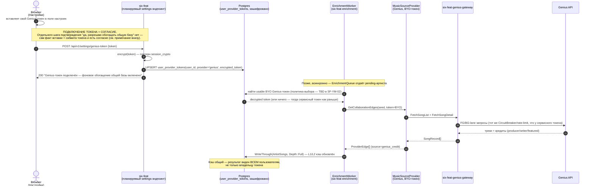

# Sequence — фоновое обогащение чужим Genius-ключом (BYO-токен)

Часть [SF-DOC-04](../../ROADMAP.md).

**Статус: план (SF-YM-02, Release 1.0), не реализовано.** На момент
SF-DOC-04 `EnrichmentWorker` (`libs/six-feat-enrichment/src/enrichment_worker.cpp`)
использует только сервисный `GeniusGatewayClient`, таблицы
`user_provider_tokens` в коде ещё нет. Диаграмма фиксирует целевой поток
из `docs/ROADMAP.md` (SF-YM-02): "Подключение = согласие на фоновое
обогащение общей базы" — **явно и сознательно без отдельного шага
подтверждения**, см. примечание внизу. Обоснование провайдер-абстракции —
[ADR-0011](../../adr/0011-music-source-provider-abstraction.md).

## Диаграмма

## Что важно не потерять при чтении

- **"Подключение = согласие" — намеренное продуктовое решение, не
  недосмотр.** `docs/ROADMAP.md` (SF-YM-02) формулирует это прямо: "Строка
  текста ДО вставки токена" — то есть согласие достигается явным
  предупреждающим текстом рядом с полем ввода токена (что произойдёт после
  подключения), а не отдельным модальным окном/чекбоксом "я согласен"
  после отправки. Смысл: тот, кто вставляет свой Genius-токен, уже видел
  предупреждение — второй шаг подтверждения был бы дублирующим трением, а
  не дополнительной защитой.
- **Токен — shared resource, не изолированный.** Результат обогащения
  через чужой BYO-токен пишется в тот же общий L1/L2-кэш
  (`ArtistRepository`), который видят все пользователи — это осознанное
  свойство модели: подключая свой Genius-токен, пользователь соглашается
  обогащать общую базу, а не только свой собственный граф.
- **Шифрование — тот же паттерн, что `session_crypto`** (AES,
  ключ из `APP_SECRET`-подобного окружения) — токен не хранится в
  открытом виде в Postgres.
- Политика выбора "чей именно BYO-токен использовать, если их несколько" —
  сознательно не зафиксирована здесь (`TBD в SF-YM-02`); диаграмма
  документирует форму потока, а не ещё не принятое решение по этому
  конкретному вопросу.
