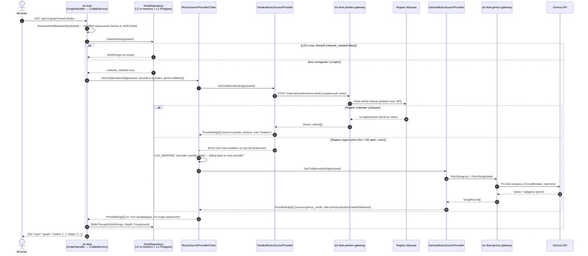

# Sequence — построение дефолтного графа (Yandex-дефолт, Genius-fallback)

Часть [SF-DOC-04](../../ROADMAP.md). Обоснование провайдер-абстракции и
разворота "Яндекс — дефолт, Genius — углубление/fallback" —
[ADR-0011](../../adr/0011-music-source-provider-abstraction.md). Топология
сервисов — [../c4-container.md](../c4-container.md).

**Статус: см. «Что важно не потерять» внизу файла** — абстракция и
провайдеры полностью реализованы и покрыты тестами (SF-ARCH-02, SF-TST-04),
но на момент SF-DOC-04 не всё, что здесь нарисовано, ещё включено в
основной публичный путь `/api/v1/graph`.

## Диаграмма

## Что важно не потерять при чтении

- **Провайдер, а не сид, определяет источник рёбер.** Оба провайдера
  возвращают `ProviderEdge{from, to}` уже с реальными Genius id (ADR-0009) —
  ни Яндекс, ни Genius не создают второе id-пространство; артист, который
  не резолвится в реальный id, просто не попадает в рёбра ни у одного из
  провайдеров.
- **Fallback — честный, не тихий**: `YandexMusicSourceProvider` **бросает**
  исключение при недоступности Яндекса (не возвращает пустой список) —
  именно это отличает "Яндекс сказал: рёбер нет" от "Яндекс недоступен,
  берём Genius". Порядок и состав провайдеров конфигурируется списком в
  `static_config.yaml` (`providers: [yandex, genius-fallback]` по
  умолчанию).
- **На момент SF-DOC-04 (проверено по коду `services/six-feat/src/application/collab_service.{hpp,cpp}`)
  сама абстракция и оба провайдера полностью реализованы и протестированы
  (`SF-ARCH-02`, `SF-TST-04`, юнит-тесты `TryProvidersInOrder`), но
  `CollabService::BuildRadialGraph`/`FetchFg` — код, который реально
  обслуживает публичный `/api/v1/graph` — на этот момент всё ещё ходит
  напрямую в `GeniusGatewayClient`, минуя `MusicSourceProviderChain`.**
  Ветка Chain→YandexProv/GeniusProv выше — целевая (спроектированная и уже
  рабочая как компонент), сегодня она реально исполняется только через
  internal-mesh observability-эндпоинт `/internal/music-source-edges`
  (`services/six-feat/src/internal/music_source_edges_handler.cpp`,
  используется тестовым арсеналом SF-ARCH-02). Перевод самого
  `BuildRadialGraph` на `MusicSourceProviderChain` — отдельный шаг
  интеграции, ещё не сделанный; документируется здесь как факт, а не как
  недостаток диаграммы.
