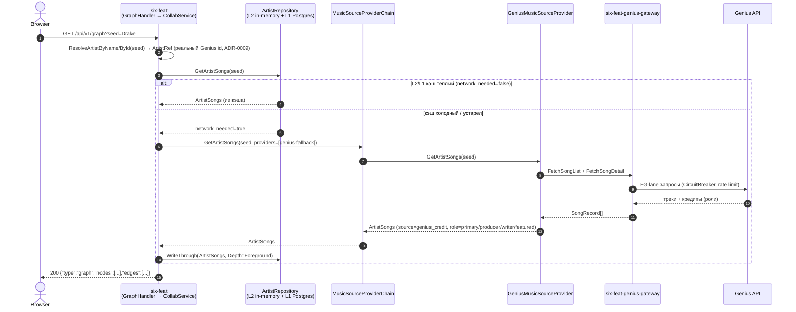

# Sequence — построение дефолтного графа (Genius, через MusicSourceProviderChain)

Часть [SF-DOC-04](../../ROADMAP.md). Обоснование провайдер-абстракции —
[ADR-0011](../../adr/0011-music-source-provider-abstraction.md). Топология
сервисов — [../c4-container.md](../c4-container.md).

**Статус: реализовано и покрыто тестами.** Яндекс.Музыка как источник
рёбер была полностью удалена (см. [ADR-0013](../../adr/0013-two-provider-artist-identity.md),
архивный) — `MusicSourceProviderChain` сегодня сконфигурирован единственным
провайдером (`providers: [genius-fallback]`), но сама абстракция
сохранена как точка расширения на будущее.

## Диаграмма

## Что важно не потерять при чтении

- **Провайдер, а не сид, определяет источник рёбер** — но сегодня провайдер
  один (`genius-fallback`), так что `edge.source` всегда `genius_credit`.
  `GeniusMusicSourceProvider` возвращает `ProviderEdge{from, to}` уже с
  реальными Genius id (ADR-0009); артист, который не резолвится в реальный
  id, просто не попадает в рёбра.
- **Резолв имени/id без Genius-токена — только из уже известного кэша.**
  `ResolveArtistByNameFromCache`/уже сохранённый в Postgres артист
  обслуживаются без обращения к `GeniusGatewayClient`; резолв **нового**
  имени или id, которого репозиторий ещё не видел, честно возвращает
  `422 no_genius_token`, если у пользователя нет Genius-токена в сессии.
- **`MusicSourceProviderChain` сохранена как абстракция**, а не выброшена
  вместе с Яндексом: `ReorderProvidersPreferring`/`TryProvidersInOrder`
  по-прежнему поддерживают несколько провайдеров и честный fallback
  (провайдер бросает исключение при недоступности, а не возвращает пустой
  список) — на случай, если у платформы снова появится второй источник
  рёбер. Список провайдеров конфигурируется в `static_config.yaml`.
