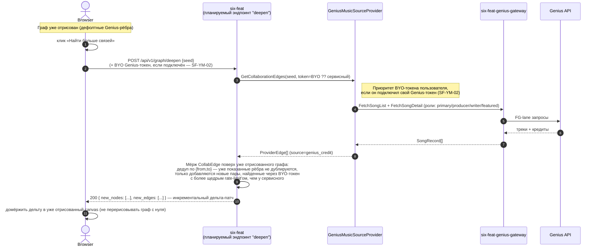

# Sequence — углубление по запросу ("найти больше связей")

Часть [SF-DOC-04](../../ROADMAP.md).

**Статус: план (SF-YM-03, Release 1.0), не реализовано.** Публичного
эндпоинта для этого потока в коде на момент SF-DOC-04 нет — сегодня
`MusicSourceProviderChain::GetCollaborationEdges` вызывается только с
internal-mesh observability-эндпоинта (см. примечание в
[build-default-graph.md](./build-default-graph.md)). Диаграмма фиксирует
целевую архитектуру потока, как описано в `docs/ROADMAP.md` (SF-YM-02,
SF-YM-03), чтобы решение было видно до реализации, а не только после.
Обоснование самой провайдер-абстракции — [ADR-0011](../../adr/0011-music-source-provider-abstraction.md).

## Диаграмма

## Что важно не потерять при чтении

- **Это углубление, не замена.** Рёбра, уже показанные пользователю,
  никуда не деваются — «найти больше связей» добавляет пары, которые
  дефолтный проход не успел найти (лимит `songs_limit` на
  foreground-запрос) или которые сервисный токен не смог получить из-за
  общего rate-limit'а с остальными пользователями.
- **BYO-токен — приоритет, не обязательность.** Работает и без него (на
  сервисном/дефолтном токене), просто ограничен обычными rate-limit'ами
  `six-feat-genius-gateway`, разделяемыми со всеми остальными
  пользователями без своего токена.
- **Идентичность не меняется.** Как и в `build-default-graph.md` — каждое
  новое ребро уже на реальных Genius id; артист, который не резолвится, в
  дельту просто не попадает (та же честная семантика "не найдено", что и
  у дефолтного графа).
