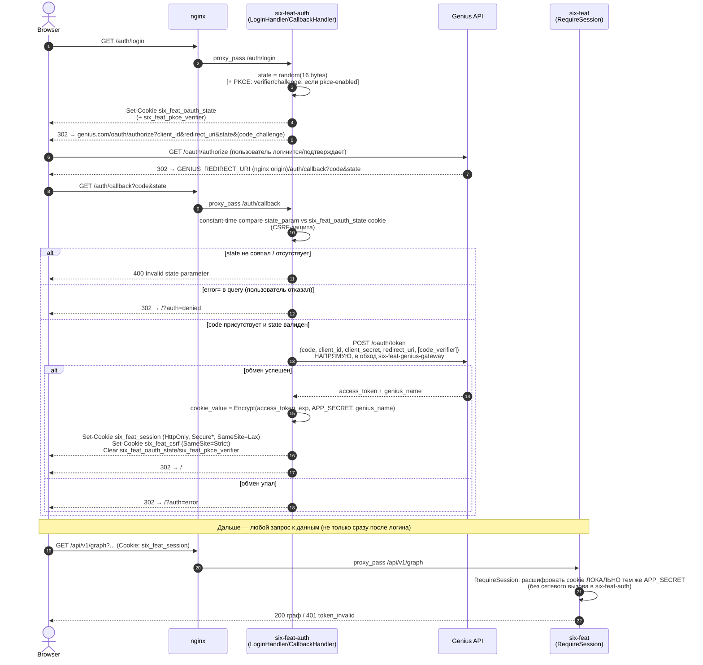

# Sequence — OAuth-логин (auth ↔ six-feat ↔ Genius)

Часть [SF-DOC-04](../../ROADMAP.md). Статус: **реализовано** (`libs/six-feat-auth-lib/src/oauth_handler.cpp`).
Обоснование разбиения "выдача сессии в six-feat-auth / проверка сессии
локально в six-feat" — [ADR-0004](../../adr/0004-auth-service-local-session-verification.md).
Топология сервисов — [../c4-container.md](../c4-container.md).

## Диаграмма

## Что важно не потерять при чтении

- **Обмен `code`→`access_token` идёт напрямую в Genius**, минуя
  `six-feat-genius-gateway` — это одноразовый вызов на логин, а не
  FG/BG-трафик, которым занят gateway (см. `docs/DEVELOPMENT.md`,
  раздел про `six-feat-auth`).
- **`six-feat` никогда не делает сетевой вызов в `six-feat-auth`**, чтобы
  проверить сессию — `RequireSession` расшифровывает cookie тем же
  `APP_SECRET`, который использовал `six-feat-auth`. Оба сервиса обязаны
  быть подняты с одинаковым `APP_SECRET`/`GENIUS_CLIENT_ID`/
  `GENIUS_CLIENT_SECRET` (последние два `six-feat` больше не использует
  для реального обмена, но валидирует при старте).
- `Secure*` на `six_feat_session`/`six_feat_csrf` — только если
  `COOKIE_SECURE=true` (см. `docs/DEVELOPMENT.md`, раздел «Env-профили:
  dev/staging/prod», SF-CFG-01: `prod`/`staging` профили включают его по
  умолчанию, `dev` — нет, локальный HTTP).
